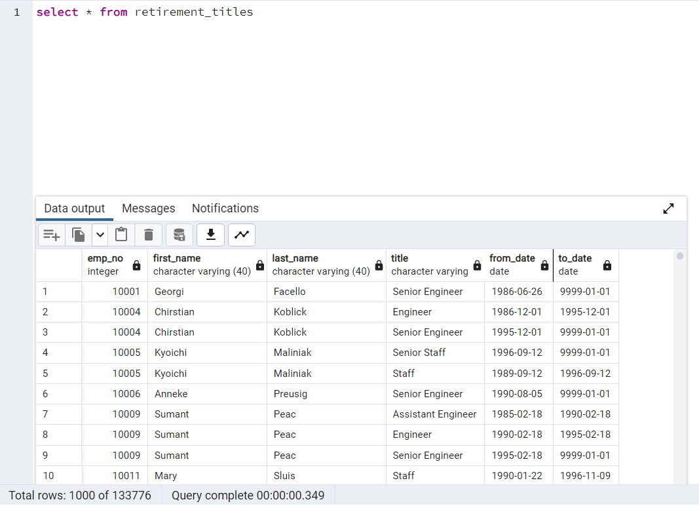
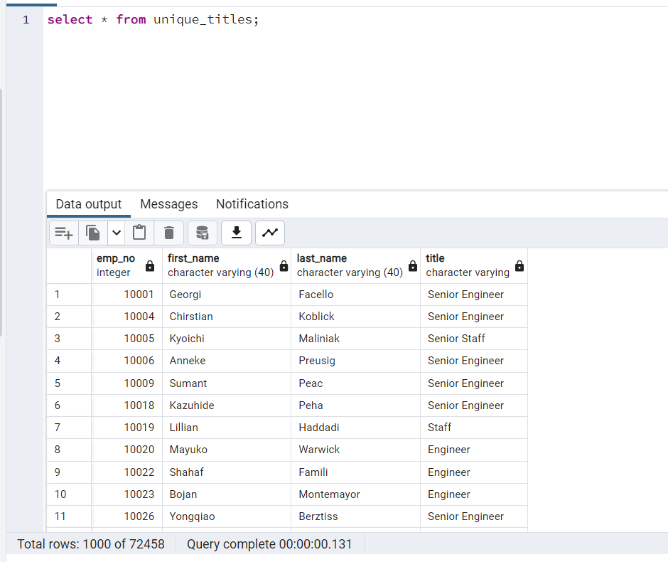
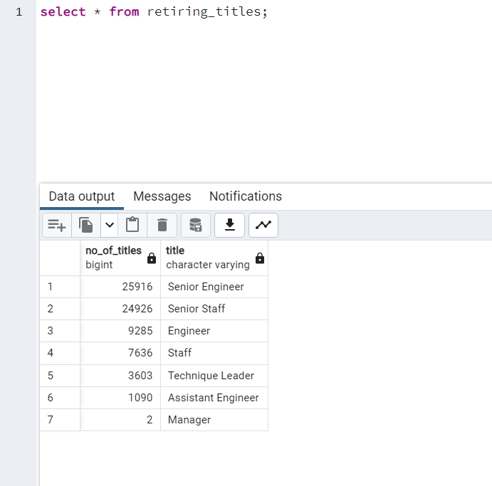
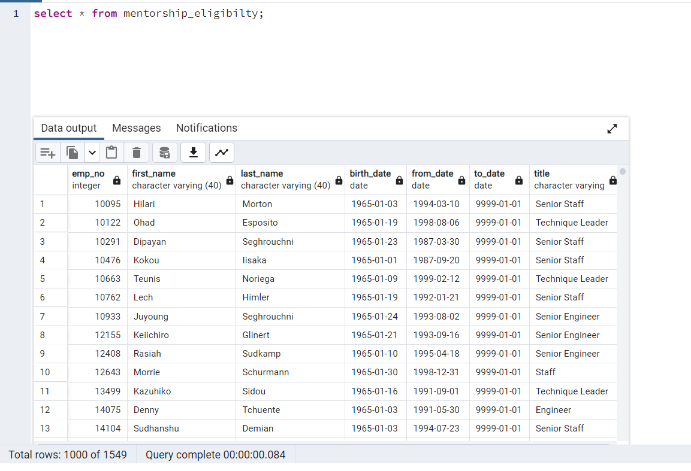

# Retiree_Employee_Analysis

## Purpose and overview

The pupose of the analysis is help the client Pewlett Hackard to identify the Employee data set for number of retiring employees per title, and identify employees who are eligible to participate in a mentorship program 

This would help the company to identify the employees who are about to retire and provide them with definate retirement package 

- Tools and Resources used
    1. Six Employee data sheets in CSV files
    2. PostgreSQL database

## Analysis and Results

### Approach Followed

- Build an employee database schema by creating the following tables and loading the given six datasheets. 
    1. departments
    2. employees
    3. salaries
    4. titles
    5. dept_emp
    6. dept_manager

- Using the ERD created above create a Retirement Titles table that holds all the titles of employees who were born between January 1, 1952 and December 31, 1955. This data is stored in **retirement_titles** table.

- retirement_title table holds **133,376** records of the employee data with their titles. Below snippet shows that few employees have duplicate records as the title of the employyes have been changed in due course of their employment

- In order to get the unique titles the data in the reitrement tables is further drilled down by filtering the records with active employement dates

- After applying the filtering logic the new data set is stored in **unique_titles** table. Below is the snippet for reference.

- From the below snippet it is evident that there are **72,458** retiree employees who hold the active employment with the unique title.

- In order to get the count of the employees holding each title the data is further grouped by title and is stored in a new table **retiring_titles**

Below is the snippet for reference. The table holds the total count of employees for each title. The data result shows that the employees  holding *Senior Engineer* and *Senior Staff* designation are retiring in large number with a total of *25916* Senior Engineers and *24926* of Senior Staff members, cumilative count to 50,842. 

- The next task is to determine the employees eligible for mentorship program. This can be acieved by creating a **mentorship-eligibility** table that holds the current employees who were born between January 1, 1965 and December 31, 1965

mentorship-elibility data table. From the below snippet the company can provide mentorship program to **1549** employees

## Summary

From the above analysis following data points can be summarized in order to give the client a clear idea of the improvements or the areas of concentration to avoid workforce crunch in future.

- From the distinct employees of 300,024 about 72,458 employees are verge of retirment and company has to devise a stragey to fill these postions.

- Since majority of the retirees belong to *Senior Engineer* and *Senior Staff* positions (Counting to 50,842) hiring team should start recrutiment process for these roles.

- By detemining the data set for mentorship eligibility the company has taken a further step to upgrade the skillset of *1549* existing employees there by securing their future and cutting down the recruitment cost involved

- Company should also collect the information from the retiree employees to determine the interest of their continuity of employment out of their free will. As there might be set of workers who are enthusiastic and skillfull to continue their employment irrespective of their age.

### References

1. Mentorship Eligibility file: [mentorship_eligibilty.csv](https://github.com/Ghousiya9891/Pewlett-Hackard-Analysis-/blob/main/Data/mentorship_eligibilty.csv)
2. Retirement titles file: [retirement_titles.csv](https://github.com/Ghousiya9891/Pewlett-Hackard-Analysis-/blob/main/Data/retirement_titles.csv)
3. Retiring titles file: [retiring_titles.csv](https://github.com/Ghousiya9891/Pewlett-Hackard-Analysis-/blob/main/Data/retiring_titles.csv)
4. Unique titles file: [unique_titles.csv](https://github.com/Ghousiya9891/Pewlett-Hackard-Analysis-/blob/main/Data/unique_titles.csv)
